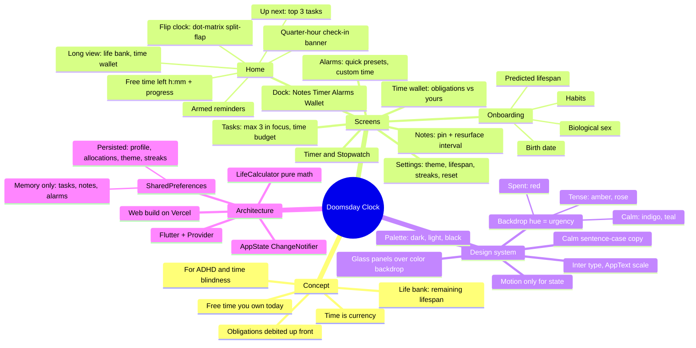
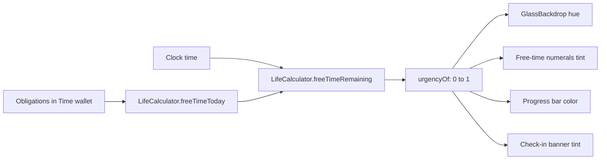

# Mind map

The whole system on one page. GitHub and VS Code (with a Mermaid extension) render this.

```mermaid
mindmap
  root((Doomsday Clock))
    Concept
      Time is currency
      Obligations debited up front
      Free time you own today
      Life bank: remaining lifespan
      For ADHD and time blindness
    Screens
      Home
        Flip clock: dot-matrix split-flap
        Free time left h:mm + progress
        Up next: top 3 tasks
        Dock: Notes Timer Alarms Wallet
        Long view: life bank, time wallet
        Armed reminders
        Quarter-hour check-in banner
      Onboarding
        Birth date
        Biological sex
        Habits
        Predicted lifespan
      Tasks: max 3 in focus, time budget
      Notes: pin + resurface interval
      Alarms: quick presets, custom time
      Timer and Stopwatch
      Time wallet: obligations vs yours
      Settings: theme, lifespan, streaks, reset
    Design system
      Palette: dark, light, black
      Glass panels over color backdrop
      Backdrop hue = urgency
        Calm: indigo, teal
        Tense: amber, rose
        Spent: red
      Inter type, AppText scale
      Calm sentence-case copy
      Motion only for state
    Architecture
      Flutter + Provider
      AppState ChangeNotifier
      LifeCalculator pure math
      SharedPreferences
        Persisted: profile, allocations, theme, streaks
        Memory only: tasks, notes, alarms
      Web build on Vercel
```

## Urgency flow

```mermaid
flowchart LR
  A[Obligations in Time wallet] --> B[LifeCalculator.freeTimeToday]
  C[Clock time] --> D[LifeCalculator.freeTimeRemaining]
  B --> D
  D --> E[urgencyOf: 0 to 1]
  E --> F[GlassBackdrop hue]
  E --> G[Free-time numerals tint]
  E --> H[Progress bar color]
  E --> I[Check-in banner tint]
```
